<div align="center">

# 🐧 Linux Commands, Administration & Bash Scripting
### Personal Reference for Junior Penetration Testing


<br>


</div>

---

## 👤 About This File

> **Author:** Youhana Emad
> **Role:** Junior Penetration Tester
> **Purpose:** Comprehensive personal reference covering Linux fundamentals, system administration, Bash scripting, and cybersecurity practice.

This file merges and expands my Linux command notes and Linux administration notes into one production-ready reference. It is designed to help me build strong command-line and sysadmin skills, understand Linux internals, and prepare for real-world penetration testing, CTF challenges, and security assessments.

> [!TIP]
> Do not just memorize commands. Run them in a safe lab environment, understand the output, and document what each command does.

---

## 📚 Table of Contents

- [🧭 Linux Filesystem Basics](#-linux-filesystem-basics)
- [🖥️ System Information Commands](#️-system-information-commands)
- [📁 File Management Commands](#-file-management-commands)
- [🔎 Searching and Filtering](#-searching-and-filtering)
- [🔤 Regular Expressions (Regex)](#-regular-expressions-regex)
- [🔐 File Permissions](#-file-permissions)
- [🗂️ File System Types](#️-file-system-types)
- [👥 User and Group Administration](#-user-and-group-administration)
  - [Session Monitoring](#session-monitoring)
  - [Essential /etc Files](#essential-etc-files)
  - [Managing User Accounts](#managing-user-accounts)
  - [Managing Groups](#managing-groups)
  - [Password Aging and Policies](#password-aging-and-policies)
  - [Locking and Unlocking Accounts](#locking-and-unlocking-accounts)
  - [GUI Administration Tools](#gui-administration-tools)
- [📖 File Viewing](#-file-viewing)
- [✏️ Text Editors](#️-text-editors)
- [🗜️ Compression and Archives](#️-compression-and-archives)
- [📚 Documentation Commands](#-documentation-commands)
- [⚙️ Process Management](#️-process-management)
- [📦 Package Management](#-package-management)
- [🌐 Networking Commands](#-networking-commands--pentesting-relevant)
- [🖊️ Bash Scripting Basics](#️-bash-scripting-basics)
- [🧪 Mini Bash Scripts](#-mini-bash-scripts)
- [🧰 Useful Aliases](#-useful-aliases)
- [🧠 Bash Best Practices](#-bash-best-practices)
- [✅ Practice Checklist](#-practice-checklist)
- [🚀 Suggested Learning Path](#-suggested-learning-path)
- [⚡ Quick Reference](#-quick-reference)
- [📚 Resources](#-resources)
- [⚠️ Ethical Reminder](#️-ethical-reminder)

---

## 🧭 Linux Filesystem Basics

Linux uses a hierarchical filesystem structure starting from the root directory `/`.

```text
/
├── bin      Essential user binaries (ls, cp, mv)
├── boot     Boot loader files and kernel images
├── dev      Device files (disks, terminals)
├── etc      System-wide configuration files
├── home     User home directories (/home/youhana)
├── lib      Shared libraries for /bin and /sbin
├── media    Auto-mounted removable media (USB, CD)
├── mnt      Temporary manual mount points
├── opt      Optional third-party applications
├── proc     Virtual filesystem — process & kernel info
├── root     Root user's home directory
├── sbin     System administration binaries
├── tmp      Temporary files (cleared on reboot)
├── usr      User programs, libraries, documentation
└── var      Variable data — logs, spool, cache
```

| Path | Purpose |
|---|---|
| `/home` | Normal users' home directories |
| `/root` | Root user's home directory |
| `/etc` | System configuration files |
| `/etc/passwd` | User account information |
| `/etc/shadow` | Encrypted passwords and aging |
| `/etc/group` | Group definitions |
| `/var/log` | System and application log files |
| `/tmp` | Temporary files |
| `/bin` | Essential user-facing commands |
| `/usr/bin` | User commands and applications |
| `/sbin` | System administration commands |

---

## 🖥️ System Information Commands

| Command | Description |
|---|---|
| `uname -a` | Display all system information |
| `hostname` | Show the system hostname |
| `uptime` | Show how long the system has been running |
| `whoami` | Print the current logged-in user |
| `id` | Display user ID (UID) and group IDs (GID) |
| `date` | Show system date and time |
| `df -h` | Show disk space usage in human-readable format |
| `du -sh <dir>` | Show total size of a directory |
| `free -h` | Display memory (RAM/swap) usage |
| `top` / `htop` | Monitor running processes in real time |
| `lscpu` | Show CPU architecture information |
| `lsblk` | List block devices (disks, partitions) |
| `dmesg` | Show kernel ring buffer messages |
| `cat /etc/os-release` | Show Linux distribution information |

<details>
<summary>💡 Example — Fingerprinting a new system</summary>

```bash
# Who am I?
whoami
# Output: kali

# What are my privileges?
id
# Output: uid=1000(kali) gid=1000(kali) groups=1000(kali),27(sudo)

# What OS is this?
cat /etc/os-release
# Output:
# NAME="Kali GNU/Linux"
# VERSION="2024.1"

# How long has the box been up?
uptime
# Output: 14:32:01 up 2 days, 3:14, 1 user, load average: 0.10, 0.08, 0.05

# Disk usage
df -h
# Output:
# Filesystem      Size  Used Avail Use% Mounted on
# /dev/sda1        50G   12G   36G  25% /
```

> **Pentesting tip:** These commands are often the first steps after getting a shell during a CTF or engagement — know your user, know your environment.

</details>

---

## 📁 File Management Commands

| Command | Description |
|---|---|
| `ls -la` | List all files including hidden ones with details |
| `pwd` | Print current working directory |
| `cd <dir>` | Change directory |
| `cd ..` | Move one directory up |
| `cd ~` | Go to current user's home directory |
| `mkdir <dir>` | Create a new directory |
| `mkdir -p a/b/c` | Create nested directories in one command |
| `rm <file>` | Remove a file |
| `rm -rf <dir>` | Remove a directory and all its contents recursively |
| `cp <src> <dst>` | Copy a file |
| `cp -r <src> <dst>` | Copy a directory recursively |
| `mv <src> <dst>` | Move or rename files/directories |
| `touch <file>` | Create an empty file or update timestamps |
| `cat <file>` | Display file contents |
| `less <file>` | View file contents page by page (press `q` to quit) |
| `head -n <n> <file>` | Show first N lines of a file |
| `tail -n <n> <file>` | Show last N lines of a file |
| `tail -f <file>` | Follow file updates live (great for logs) |
| `nl <file>` | Display file with line numbers |

> [!WARNING]
> `rm -rf` deletes recursively and permanently without confirmation. Always double-check the path.

<details>
<summary>💡 Practical Examples</summary>

```bash
# Copy flags structure for a CTF writeup
mkdir -p ctf/htb/machine1
touch ctf/htb/machine1/user.txt ctf/htb/machine1/root.txt

# List everything including hidden dotfiles
ls -la /home/youhana
# Output:
# total 48
# drwxr-xr-x 6 youhana youhana 4096 May 30 09:00 .
# drwxr-xr-x 3 root    root    4096 May 28 12:00 ..
# -rw------- 1 youhana youhana  512 May 30 08:55 .bash_history
# -rw-r--r-- 1 youhana youhana  220 May 28 12:00 .bash_logout

# Backup /etc/passwd before modification
cp /etc/passwd /tmp/passwd.bak

# Rename a file
mv old_report.txt final_report.txt

# Watch a log file live
tail -f /var/log/auth.log
```

</details>

---

## 🔎 Searching and Filtering

| Command | Description |
|---|---|
| `find / -name <file> 2>/dev/null` | Search for a file by name, suppress errors |
| `find . -type f -name "*.txt"` | Find all `.txt` files in current directory |
| `find / -perm 777` | Find files with full permissions (777) |
| `find / -size +1M` | Find files larger than 1 MB |
| `find / -user <username>` | Find files owned by a specific user |
| `find / -empty` | Find empty files and directories |
| `find / -name "*.txt" -exec cat {} \;` | Find and execute a command on results |
| `locate <file>` | Quickly find a file by name (uses database) |
| `updatedb` | Update the `locate` database |
| `grep "text" <file>` | Search for text inside a file |
| `grep -r "text" .` | Search recursively inside all files |
| `grep -i "text" <file>` | Case-insensitive search |
| `grep -n "text" <file>` | Show line numbers in results |
| `grep -v "text" <file>` | Invert match — show lines NOT containing text |
| `sort <file>` | Sort lines alphabetically |
| `sort -n <file>` | Sort lines numerically |
| `uniq <file>` | Remove adjacent duplicate lines |
| `sort <file> \| uniq -c` | Count occurrences of each unique line |
| `sort <file> \| uniq -u` | Show lines that appear exactly once |
| `wc -l <file>` | Count number of lines |
| `cut -d ":" -f1 /etc/passwd` | Extract the first field (username) from passwd |

<details>
<summary>🎯 CTF and Pentesting Examples</summary>

```bash
# Find a readable file owned by a specific user (OverTheWire Bandit style)
find / -user bandit7 -type f -readable 2>/dev/null

# Find files with SUID bit set (privilege escalation research)
find / -perm -4000 -type f 2>/dev/null
# Common output: /usr/bin/passwd, /usr/bin/sudo

# Search for password strings inside all text files
grep -ri "password" /var/www/html/ 2>/dev/null

# Show lines containing "admin" with line numbers
grep -n "admin" /etc/passwd

# Find the only unique line in a file (Bandit Level 8)
sort data.txt | uniq -u
# Output: the single unique password line

# Count how many failed SSH login attempts
grep "Failed password" /var/log/auth.log | wc -l

# Extract all usernames from /etc/passwd
cut -d ":" -f1 /etc/passwd
# Output:
# root
# daemon
# youhana
# ...

# Find and move a file
find / -name "rockyou.txt" -exec cp {} /tmp/wordlists/ \;
```

</details>

---

## 🔤 Regular Expressions (Regex)

Regular expressions (regex) are patterns used with `grep`, `sed`, `awk`, and other tools to match text.

| Pattern | Meaning |
|---|---|
| `.` | Any single character |
| `^` | Start of line |
| `$` | End of line |
| `*` | Zero or more of the preceding character |
| `+` | One or more of the preceding character |
| `?` | Zero or one of the preceding character |
| `[abc]` | Any one of `a`, `b`, or `c` |
| `[^abc]` | Any character except `a`, `b`, or `c` |
| `\w` | Word character (letters, digits, underscore) |
| `\d` | Digit `[0-9]` |
| `\s` | Whitespace (space, tab) |
| `\W` | Non-word character |
| `\D` | Non-digit |
| `\S` | Non-whitespace |
| `\d{2}` | Exactly 2 digits |
| `\w{5}` | Exactly 5 word characters |

<details>
<summary>💡 Regex Examples with grep</summary>

```bash
# Find lines starting with "root"
grep "^root" /etc/passwd
# Output: root:x:0:0:root:/root:/bin/bash

# Find lines ending with "bash"
grep "bash$" /etc/passwd

# Match words followed by 3 digits (e.g., "Hello612")
echo "Hello612 we are here" | grep -E "\w{5}[0-9]{3}"
# Output: Hello612 we are here

# Find IP addresses in a log file
grep -E "([0-9]{1,3}\.){3}[0-9]{1,3}" access.log

# Find email addresses
grep -E "[a-zA-Z0-9._%+-]+@[a-zA-Z0-9.-]+\.[a-zA-Z]{2,}" contacts.txt

# Case-insensitive search for "admin" or "root"
grep -iE "admin|root" users.txt
```

</details>

---

## 🔐 File Permissions

### Understanding Permission Notation

```text
-rwxr-xr--
 ↑↑↑ ↑↑↑ ↑↑↑
 │    │   └── Others:  r-- = read only (4)
 │    └─────── Group:  r-x = read + execute (5)
 └──────────── Owner:  rwx = read + write + execute (7)

First character: - = file | d = directory | l = symlink
```

| Symbol | Octal | Meaning |
|---|---|---|
| `r` | 4 | Read |
| `w` | 2 | Write |
| `x` | 1 | Execute |
| `-` | 0 | No permission |

### Numeric Permission Reference

| Octal | Binary | Permission |
|---|---|---|
| `7` | 111 | `rwx` read, write, execute |
| `6` | 110 | `rw-` read, write |
| `5` | 101 | `r-x` read, execute |
| `4` | 100 | `r--` read only |
| `0` | 000 | `---` no permissions |

### Common Permission Commands

| Command | Description |
|---|---|
| `ls -l` | View file permissions |
| `chmod 755 <file>` | Set permissions using numeric notation |
| `chmod u+x <file>` | Add execute permission for owner |
| `chmod g-w <file>` | Remove write permission from group |
| `chmod o-r <file>` | Remove read permission from others |
| `chown user:group <file>` | Change owner and group of a file |
| `chown -R user:group <dir>` | Recursively change ownership |
| `chgrp <group> <file>` | Change group ownership only |
| `umask` | Show or set default permission mask |

<details>
<summary>💡 chmod Before/After Examples</summary>

```bash
# Create a test file and check initial permissions
touch secret.sh
ls -l secret.sh
# -rw-r--r-- 1 youhana youhana 0 May 30 10:00 secret.sh
# Owner: rw- (6), Group: r-- (4), Others: r-- (4) => 644

# Make it executable for owner only
chmod 700 secret.sh
ls -l secret.sh
# -rwx------ 1 youhana youhana 0 May 30 10:00 secret.sh
# Only owner can read, write, and execute

# Add execute for everyone (common for shared scripts)
chmod 755 secret.sh
ls -l secret.sh
# -rwxr-xr-x 1 youhana youhana 0 May 30 10:00 secret.sh

# Use symbolic mode to add execute for owner
chmod u+x script.sh

# Remove write from group and others
chmod go-w shared.txt

# Change ownership to alice, group admins
chown alice:admins file.txt
ls -l file.txt
# -rwxr-xr-x 1 alice admins 512 May 30 10:00 file.txt

# Change group only
chgrp developers project.py
```

</details>

### Special Permissions

| Permission | Command | Octal | Effect |
|---|---|---|---|
| SUID (Set User ID) | `chmod u+s file` | `4xxx` | Executes as file owner, not caller |
| SGID (Set Group ID) | `chmod g+s dir` | `2xxx` | New files inherit directory's group |
| Sticky Bit | `chmod +t dir` | `1xxx` | Only owner can delete their own files |

<details>
<summary>🔐 Special Permissions — Pentesting Context</summary>

```bash
# Find all SUID files (privilege escalation research)
find / -perm -4000 -type f 2>/dev/null
# Common hits: /usr/bin/passwd, /usr/bin/sudo, /usr/bin/pkexec

# Find SGID files
find / -perm -2000 -type f 2>/dev/null

# Sticky bit on /tmp — only owner can delete their own files
ls -ld /tmp
# drwxrwxrwt 14 root root 4096 May 30 10:00 /tmp
#          ↑ The 't' is the sticky bit

# Set sticky bit on a shared directory
chmod +t /shared
ls -ld /shared
# drwxrwxrwt 2 root root 4096 May 30 10:00 /shared
```

</details>

### chattr — Immutable File Attributes

`chattr` sets attributes on Linux files that go beyond standard permissions — even root cannot modify an immutable file.

| Command | Description |
|---|---|
| `chattr +i <file>` | Make file immutable — cannot be modified, deleted, or renamed |
| `chattr -i <file>` | Remove immutable flag |
| `chattr +a <file>` | Append-only — file can only have data added, not overwritten |
| `chattr +A <file>` | Do not update access time (performance) |
| `lsattr <file>` | List file attributes |

<details>
<summary>💡 chattr Usage with Verification</summary>

```bash
# Create a file and set immutable
touch important.conf
chattr +i important.conf

# Verify the attribute
lsattr important.conf
# ----i---------e--- important.conf
#     ↑ 'i' = immutable

# Try to delete it — even as root
rm important.conf
# rm: cannot remove 'important.conf': Operation not permitted

# Try to overwrite
echo "test" > important.conf
# bash: important.conf: Operation not permitted

# Remove the immutable flag
chattr -i important.conf
rm important.conf   # Now works

# Set append-only (good for log files)
chattr +a /var/log/myapp.log
lsattr /var/log/myapp.log
# -----a--------e--- /var/log/myapp.log
# Data can be appended but not overwritten or deleted
```

</details>

---

## 🗂️ File System Types

| Filesystem | Full Name | Key Features | Use Case |
|---|---|---|---|
| **EXT4** | Extended Filesystem v4 | Supports files up to 16 TB, journaling, fast | Default for most Linux distros |
| **NTFS** | New Technology Filesystem | Large file support, encryption (EFS), ACLs | Windows OS, dual-boot drives |
| **FAT32** | File Allocation Table 32 | Universal compatibility, 4 GB file size limit | USB drives, BIOS boot |
| **ISO 9660** | — | Read-only, optical media standard | CDs, DVDs, bootable ISOs |
| **NFS** | Network File System | Remote filesystem over a network | Enterprise servers, NAS |
| **SMB/CIFS** | Server Message Block | Cross-platform network sharing, Windows-native | Windows shares, Samba |
| **tmpfs** | Temporary Filesystem | RAM-backed, fast, cleared on reboot | `/tmp`, `/run` |

<details>
<summary>💡 Practical Filesystem Commands</summary>

```bash
# View all mounted filesystems
df -Th
# Output:
# Filesystem     Type      Size  Used Avail Use% Mounted on
# /dev/sda1      ext4       50G   12G   36G  25% /
# tmpfs          tmpfs     2.0G  1.2M  2.0G   1% /run

# List block devices and filesystem types
lsblk -f
# Output:
# NAME   FSTYPE   LABEL    UUID   MOUNTPOINT
# sda
# └─sda1 ext4              xxxx   /

# Check filesystem of a device
blkid /dev/sda1
# /dev/sda1: UUID="xxxx" TYPE="ext4" PARTUUID="xxxx"

# Mount a USB drive
mount /dev/sdb1 /mnt/usb

# Mount an NFS share
mount -t nfs 192.168.1.10:/shared /mnt/nfs

# Unmount
umount /mnt/usb
```

</details>

---

## 👥 User and Group Administration

### Session Monitoring

Use these commands to see who is on your system right now — important for auditing and incident response.

| Command | Description |
|---|---|
| `who` | Show who is currently logged in |
| `w` | Show who is logged in and what they are doing |
| `last` | Show history of logins and logouts |
| `users` | List usernames of currently logged-in users |
| `lastb` | Show failed login attempts (requires root) |

<details>
<summary>💡 Session Monitoring Examples</summary>

```bash
who
# Output:
# youhana  pts/0        2024-05-30 09:00 (192.168.1.100)
# root     pts/1        2024-05-30 09:05 (:0)

w
# Output:
#  09:15:32 up 2 days,  3:47,  2 users,  load average: 0.00, 0.01, 0.05
# USER     TTY      FROM             LOGIN@   IDLE JCPU   PCPU WHAT
# youhana  pts/0    192.168.1.100    09:00    2:00  0.04s  0.04s bash

last | head -10
# youhana  pts/0        192.168.1.100    Thu May 30 09:00   still logged in
# root     tty1                          Wed May 29 08:00 - 08:30  (00:30)
```

</details>

---

### Essential /etc Files

These files are the core of Linux user and group management. Understanding them is critical for both administration and penetration testing.

| File | Description |
|---|---|
| `/etc/passwd` | User account information (username, UID, GID, home, shell) |
| `/etc/shadow` | Encrypted password hashes and aging policy |
| `/etc/group` | Group definitions and membership |
| `/etc/gshadow` | Secure group account information |
| `/etc/sudoers` | Defines who can run commands with `sudo` |
| `/etc/skel` | Template directory — files here are copied to new users' home |
| `/etc/login.defs` | System-wide defaults for user creation (UID ranges, etc.) |

<details>
<summary>💡 Reading and Understanding /etc/passwd and /etc/shadow</summary>

**`/etc/passwd` format:**
```
youhana:x:1000:1000:Youhana Emad:/home/youhana:/bin/bash
│       │ │    │    │             │              └── Login shell
│       │ │    │    │             └── Home directory
│       │ │    │    └── Comment / Full name (GECOS)
│       │ │    └── Primary GID
│       │ └── UID
│       └── 'x' = password stored in /etc/shadow
└── Username
```

```bash
# List all users
cat /etc/passwd

# Extract usernames only
cut -d ":" -f1 /etc/passwd

# Check which users have a real shell (potential login accounts)
grep -v "/nologin\|/false" /etc/passwd | cut -d ":" -f1
```

**`/etc/shadow` format:**
```
admin:$y$j9T$CbCT...:19957:0:99999:7:::
│     │              │     │ │     │└── Account expiration (days since 1970-01-01)
│     │              │     │ │     └── Days inactive after expiry before lock
│     │              │     │ └── Max days before password must be changed
│     │              │     └── Min days before password can be changed
│     │              └── Days since last password change (since 1970-01-01)
│     └── Password hash ($y$ = yescrypt, $6$ = SHA-512, $1$ = MD5)
└── Username
```

```bash
# View shadow file (requires root)
sudo cat /etc/shadow

# Check hash algorithm in use
sudo grep youhana /etc/shadow | cut -d"$" -f2
# Output: y  (yescrypt), or 6 (SHA-512)
```

**`/etc/sudoers` examples:**
```bash
# Allow user to run all commands as any user with no password
kali ALL=(ALL) NOPASSWD: ALL

# Allow user to run only specific commands
youhana ALL=(ALL) /usr/bin/apt, /usr/bin/systemctl
```

</details>

---

### Managing User Accounts

#### Adding Users

```bash
# Full useradd with home directory, bash shell, and sudo group
useradd -m -s /bin/bash -G sudo john

# Options explained:
# -m  = create home directory at /home/john
# -s  = set login shell
# -G  = add to supplementary group(s)
# -c  = comment/full name
# -u  = specify UID

# Set or change password
passwd john
# New password: ••••••••
# Retype new password: ••••••••
# passwd: password updated successfully
```

<details>
<summary>💡 User Creation with Verification Steps</summary>

```bash
# Step 1: Create user
useradd -m -s /bin/bash -G sudo -c "Test Account" testuser

# Step 2: Set a password
passwd testuser

# Step 3: Verify the user was created
id testuser
# uid=1001(testuser) gid=1001(testuser) groups=1001(testuser),27(sudo)

# Step 4: Verify home directory
ls -la /home/testuser
# drwxr-xr-x 2 testuser testuser 4096 May 30 10:00 .
# drwxr-xr-x 5 root     root     4096 May 30 10:00 ..
# -rw-r--r-- 1 testuser testuser  220 May 30 10:00 .bash_logout

# Step 5: Check /etc/passwd entry
grep testuser /etc/passwd
# testuser:x:1001:1001:Test Account:/home/testuser:/bin/bash

# Step 6: Verify sudo membership
grep testuser /etc/sudoers.d/ 2>/dev/null || groups testuser
# testuser : testuser sudo
```

</details>

#### Modifying Users

| Command | Description |
|---|---|
| `usermod -d /new/dir <user>` | Change home directory |
| `usermod -l newname <user>` | Rename the user account |
| `usermod -s /bin/zsh <user>` | Change login shell |
| `usermod -G group1,group2 <user>` | Set supplementary groups (replaces existing) |
| `usermod -aG newgroup <user>` | Add to group without removing existing groups |
| `usermod -g newgroup <user>` | Change primary group |
| `usermod -L <user>` | Lock the user account |
| `usermod -U <user>` | Unlock the user account |
| `usermod -e YYYY-MM-DD <user>` | Set account expiration date |

<details>
<summary>💡 usermod Examples</summary>

```bash
# Change shell to zsh
usermod -s /bin/zsh john
grep john /etc/passwd | cut -d: -f7
# /bin/zsh

# Rename user from john to johnny
usermod -l johnny john
id johnny
# uid=1001(johnny) gid=1001(john) ...

# Add john to docker group without removing other groups
usermod -aG docker john
groups john
# john : john sudo docker

# Set account to expire on 2025-12-31
usermod -e 2025-12-31 john
chage -l john | grep "Account expires"
# Account expires                         : Dec 31, 2025
```

</details>

#### Deleting Users

```bash
# Delete user and their home directory
userdel -r john

# Verify removal
id john
# id: 'john': no such user

grep john /etc/passwd
# (no output)

ls /home/john
# ls: cannot access '/home/john': No such file or directory
```

#### Listing User Information

```bash
# Show UID, GID, groups for a user
id youhana
# uid=1000(youhana) gid=1000(youhana) groups=1000(youhana),27(sudo)

# List all users
cat /etc/passwd | cut -d: -f1,3,6,7
# root:0:/root:/bin/bash
# youhana:1000:/home/youhana:/bin/bash

# Force user to change password at next login
passwd -e john
# Expiring password for user john.
# passwd: Success
```

---

### Managing Groups

| Command | Description |
|---|---|
| `groupadd <groupname>` | Create a new group |
| `groupadd -g 2000 <groupname>` | Create a group with a specific GID |
| `groupdel <groupname>` | Delete a group |
| `groupmod -n newname <oldname>` | Rename a group |
| `groupmod -g 2000 <groupname>` | Change a group's GID |
| `usermod -aG <group> <user>` | Add a user to a group |
| `gpasswd -d <user> <group>` | Remove a user from a group |
| `groups <user>` | List groups a user belongs to |
| `getent group <groupname>` | Get detailed information about a group |

<details>
<summary>💡 Group Management with Verification</summary>

```bash
# Create a new group
groupadd developers
groupadd -g 3000 security

# Verify creation
getent group developers
# developers:x:1002:

getent group security
# security:x:3000:

# Add users to the group
usermod -aG developers alice
usermod -aG developers bob
usermod -aG security youhana

# Verify membership
groups alice
# alice : alice developers

getent group developers
# developers:x:1002:alice,bob

# Remove a user from a group
gpasswd -d bob developers
getent group developers
# developers:x:1002:alice

# Rename the group
groupmod -n devteam developers
getent group devteam
# devteam:x:1002:alice

# Set a group password (allows users to switch to group with sg)
gpasswd security

# Delete a group
groupdel devteam
```

</details>

---

### Password Aging and Policies

The `chage` command controls password expiration and aging policy for user accounts.

| Command | Description |
|---|---|
| `chage -l <user>` | Display password aging information for a user |
| `chage -m <days> <user>` | Set minimum days between password changes |
| `chage -M <days> <user>` | Set maximum days before password must be changed |
| `chage -W <days> <user>` | Set number of days to warn user before expiry |
| `chage -I <days> <user>` | Days of inactivity after expiry before account locks |
| `chage -E YYYY-MM-DD <user>` | Set account expiration date |
| `chage -d 0 <user>` | Force password change on next login |

<details>
<summary>💡 Password Policy Configuration with Verification</summary>

```bash
# View current password aging info for user john
chage -l john
# Last password change                    : May 30, 2024
# Password expires                        : never
# Password inactive                       : never
# Account expires                         : never
# Minimum number of days between change   : 0
# Maximum number of days between change   : 99999
# Number of days of warning before expiry : 7

# Set a full password policy:
# - Must be changed every 90 days
# - Cannot change it again for 7 days
# - Warn 14 days before expiry
# - Lock 5 days after expiry
# - Account expires 2025-12-31
chage -M 90 -m 7 -W 14 -I 5 -E 2025-12-31 john

# Verify the changes
chage -l john
# Last password change                    : May 30, 2024
# Password expires                        : Aug 28, 2024
# Password inactive                       : Sep 02, 2024
# Account expires                         : Dec 31, 2025
# Minimum number of days between change   : 7
# Maximum number of days between change   : 90
# Number of days of warning before expiry : 14

# Force john to change password on next login
chage -d 0 john

# Cross-check via /etc/shadow
sudo grep john /etc/shadow
# john:$6$...:0:7:90:14:5:20088:
#                ↑ ↑  ↑  ↑  ↑   └── Account expiry (days since 1970)
#                │ │  │  │  └── Inactive days after expiry
#                │ │  │  └── Warning days
#                │ │  └── Max days
#                │ └── Min days
#                └── Last changed (0 = must change on next login)
```

</details>

---

### Locking and Unlocking Accounts

Multiple methods exist to prevent a user from logging in:

| Method | Command | Effect |
|---|---|---|
| Lock password | `passwd -l <user>` | Prepends `!` to hash in `/etc/shadow` |
| Disable shell | `usermod -s /sbin/nologin <user>` | Shell denies login with a message |
| Set false shell | `usermod -s /bin/false <user>` | Shell exits immediately, no message |
| Expire account | `usermod -e 1 <user>` | Sets account expiry to the past |
| Unlock | `passwd -u <user>` | Removes `!` from shadow file |
| Restore shell | `usermod -s /bin/bash <user>` | Re-enables login shell |

<details>
<summary>💡 Locking Accounts with Verification</summary>

```bash
# Method 1: Lock via passwd
passwd -l john

# Verify — the hash now starts with '!'
sudo grep john /etc/shadow | cut -d: -f2 | cut -c1-2
# !$

# Try to switch to john (will fail)
su - john
# su: Authentication failure

# Unlock
passwd -u john
sudo grep john /etc/shadow | cut -d: -f2 | cut -c1-2
# $6  (hash restored, no '!')

# Method 2: Set nologin shell (graceful message)
usermod -s /sbin/nologin john
su - john
# This account is currently not available.

# Method 3: Set false shell (silent exit)
usermod -s /bin/false john

# Restore to bash
usermod -s /bin/bash john
```

</details>

---

### GUI Administration Tools

For systems with a graphical interface or web browser, these tools provide a point-and-click alternative:

```bash
# GNOME graphical user manager
sudo apt install gnome-system-tools
# Access via: Settings → Users

# KDE user manager
sudo apt install kuser

# Cockpit — web-based server management (recommended for servers)
sudo apt install cockpit
sudo systemctl enable --now cockpit
# Access via browser at: http://localhost:9090
# Provides user management, process monitoring, logs, and more
```

---

## 📖 File Viewing

| Command | Description |
|---|---|
| `cat <file>` | Display full file contents |
| `less <file>` | Page through file (`q` to quit, `/` to search) |
| `more <file>` | Older pager (only scrolls forward) |
| `head -n 20 <file>` | Show first 20 lines |
| `tail -n 20 <file>` | Show last 20 lines |
| `tail -f <file>` | Live follow file updates (logs) |
| `nl <file>` | Display file with line numbers |
| `xxd <file>` | Hex dump of file (useful for binary analysis) |
| `strings <file>` | Extract printable strings from binary |

<details>
<summary>🎯 CTF File Reading Examples</summary>

```bash
# Concatenate multiple files
cat /etc/passwd /etc/group | grep "youhana"

# Follow a log during an attack test
tail -f /var/log/apache2/access.log

# Find strings in a binary (CTF — extracting hidden data)
strings suspicious_binary | grep -i "flag\|password\|key"

# Hex dump of a file (looking for magic bytes or hidden data)
xxd file.bin | head -20
# 00000000: 7f45 4c46 0201 0100 0000 0000 0000 0000  .ELF............
```

</details>

---

## ✏️ Text Editors

```bash
# Nano — beginner-friendly
nano file.txt
# Ctrl+O = save | Ctrl+X = exit | Ctrl+W = search

# Vim — powerful, modal editor
vim file.txt
# i = insert mode | Esc = normal mode | :w = save | :q = quit | :wq = save & quit
# :%s/old/new/g = find and replace all

# Quick file edit with echo
echo "new content" >> file.txt

# Replace a line using sed
sed -i 's/old_text/new_text/g' file.txt
```

---

## 🗜️ Compression and Archives

| Command | Description |
|---|---|
| `tar -czf archive.tar.gz <dir>` | Create a gzip-compressed archive |
| `tar -xvf archive.tar.gz` | Extract an archive |
| `tar -tf archive.tar.gz` | List contents without extracting |
| `zip -r files.zip <dir>` | Create a zip archive |
| `unzip files.zip` | Extract a zip archive |
| `unzip -l files.zip` | List zip contents |
| `gzip <file>` | Compress a file (replaces original) |
| `gunzip <file>.gz` | Decompress a .gz file |

<details>
<summary>💡 Archive Examples</summary>

```bash
# Create a timestamped backup archive
tar -czf backup_$(date +%Y%m%d).tar.gz /home/youhana/projects/

# Extract to a specific directory
tar -xvf archive.tar.gz -C /tmp/extracted/

# View contents before extracting
tar -tf archive.tar.gz
# projects/
# projects/notes.txt
# projects/scripts/backup.sh

# Password-protected zip (useful for CTF data transfer)
zip -P secretpass protected.zip sensitive.txt
unzip -P secretpass protected.zip
```

</details>

---

## 📚 Documentation Commands

```bash
man ls           # Full manual page for 'ls'
man 5 passwd     # Section 5 — file formats (e.g., /etc/passwd format)
apropos scan     # Find commands related to 'scan'
whatis nmap      # One-line description of nmap
info bash        # GNU info page for bash
tldr ls          # Simplified, example-focused man pages (install: apt install tldr)
sudo mandb       # Update the man page database
```

---

## ⚙️ Process Management

| Command | Description |
|---|---|
| `ps aux` | Show all running processes |
| `ps aux \| grep <name>` | Find a specific process |
| `top` | Monitor processes live |
| `htop` | Interactive process monitor (color, mouse) |
| `kill <PID>` | Terminate a process by PID (SIGTERM) |
| `kill -9 <PID>` | Force kill a process (SIGKILL — cannot be caught) |
| `pkill <name>` | Kill all processes matching a name |
| `pgrep <name>` | Find PID of a process by name |
| `jobs` | List background jobs in current shell |
| `bg` | Resume a job in the background |
| `fg` | Bring a background job to the foreground |
| `<cmd> &` | Run a command in the background |
| `nohup <cmd> &` | Run command that survives terminal close |
| `nice -n 10 <cmd>` | Run command with lower priority (higher nice = lower priority) |

<details>
<summary>💡 Process Management Examples</summary>

```bash
# Find the PID of nginx
pgrep nginx
# 1523

# Kill a process gracefully
kill 1523

# Force kill if unresponsive
kill -9 1523

# Start a long job in background
nmap -sV 192.168.1.0/24 -oN scan.txt &
# [1] 4821

# Check background jobs
jobs
# [1]+  Running   nmap -sV 192.168.1.0/24 -oN scan.txt &

# Bring to foreground
fg 1

# See CPU/memory usage of a specific process
ps aux | grep nmap
# youhana  4821  99.0  0.5 123456 10240 pts/0  R  10:00   5:23 nmap -sV ...
```

</details>

---

## 📦 Package Management

### Debian / Ubuntu / Kali — APT

```bash
sudo apt update                     # Refresh package lists
sudo apt upgrade                    # Upgrade all installed packages
sudo apt install <package>          # Install a package
sudo apt remove <package>           # Remove a package (keep config)
sudo apt purge <package>            # Remove package and config files
sudo apt autoremove                 # Remove unused dependency packages
sudo apt search <keyword>           # Search for a package
sudo apt show <package>             # Show detailed info about a package
sudo apt list --installed           # List all installed packages
dpkg -l | grep <name>              # Check if a specific package is installed
```

### Red Hat / CentOS / Fedora — YUM / DNF

```bash
sudo yum install <package>         # Install a package (older systems)
sudo dnf install <package>         # Install a package (modern systems)
sudo dnf update                    # Update all packages
sudo dnf remove <package>          # Remove a package
sudo rpm -qa                       # List all installed RPM packages
sudo rpm -qi <package>             # Query info about a package
```

<details>
<summary>💡 Practical apt Examples</summary>

```bash
# Install essential pentesting tools
sudo apt update
sudo apt install nmap netcat gobuster hydra -y

# Check if a package is installed
dpkg -l | grep nmap
# ii  nmap   7.94   amd64   The Network Mapper

# Find which package provides a command
dpkg -S /usr/bin/nmap
# nmap: /usr/bin/nmap

# Hold a package at its current version (prevent upgrades)
sudo apt-mark hold nmap
```

</details>

---

## 🌐 Networking Commands — Pentesting Relevant

> [!IMPORTANT]
> Use scanning and testing commands **only** on systems you own or have explicit written permission to test.

| Command | Description |
|---|---|
| `ip a` / `ifconfig` | Show all network interfaces and IP addresses |
| `ip route` | Show routing table |
| `ping -c 4 <host>` | Test connectivity (4 packets) |
| `netstat -tuln` | List open ports and listening services |
| `ss -tuln` | Modern, faster replacement for `netstat` |
| `ss -tulnp` | Show ports with associated process names |
| `nmap <target>` | Port scan a target |
| `nmap -sV <target>` | Service version detection |
| `nmap -A <target>` | Aggressive scan (OS, services, scripts) |
| `curl -I <url>` | Fetch HTTP headers only |
| `curl <url>` | Transfer data from a URL |
| `wget <url>` | Download a file from the web |
| `traceroute <host>` | Trace the network path to a host |
| `dig <domain>` | DNS lookup — full response |
| `dig +short <domain>` | Quick DNS lookup |
| `whois <domain>` | Domain registration information |
| `tcpdump -i <iface>` | Capture raw network packets |
| `tcpdump -i eth0 port 80` | Capture only HTTP traffic |
| `nc -lvnp <port>` | Listen on a port (netcat listener) |
| `nc <host> <port>` | Connect to a host on a port |

<details>
<summary>🧪 Safe Lab Networking Examples</summary>

```bash
# View your IP address
ip a | grep "inet " | grep -v 127.0.0.1
# inet 192.168.1.50/24 brd 192.168.1.255 scope global eth0

# Scan your own machine
nmap 127.0.0.1
# PORT     STATE SERVICE
# 22/tcp   open  ssh
# 80/tcp   open  http

# Show what's listening on your machine
ss -tulnp
# Netid  State   Recv-Q  Send-Q  Local Address:Port   Process
# tcp    LISTEN  0       128     0.0.0.0:22            sshd

# Quick DNS check
dig +short google.com
# 142.250.185.46

# Test if a port is open (bash TCP trick — no nmap needed)
timeout 3 bash -c "cat < /dev/null > /dev/tcp/192.168.1.1/80" 2>/dev/null && echo "Open" || echo "Closed"

# Set up a netcat listener (for CTF reverse shells)
nc -lvnp 4444

# Capture traffic on eth0 to a file
sudo tcpdump -i eth0 -w capture.pcap

# Download a file silently
wget -q https://example.com/file.txt -O /tmp/file.txt
```

</details>

---

## 🖊️ Bash Scripting Basics

### 1. Hello World Script

```bash
#!/bin/bash
# The shebang line tells the OS to use bash to run this script

echo "Hello, World!"
echo "Script: $0"
echo "Running as: $(whoami)"
```

```bash
# Make it executable and run
chmod +x hello.sh
./hello.sh
# Hello, World!
# Script: ./hello.sh
# Running as: youhana
```

---

### 2. Variables

```bash
#!/bin/bash

# Assign variables (no spaces around =)
name="Youhana"
role="Junior Penetration Tester"
year=2024

# Use variables with $
echo "My name is $name"
echo "Role: $role"
echo "Year: $year"

# Command substitution — store command output in a variable
current_user=$(whoami)
kernel=$(uname -r)
echo "Logged in as: $current_user on kernel $kernel"

# Readonly variable (cannot be changed)
readonly TOOL="nmap"
echo "Favorite tool: $TOOL"
```

---

### 3. User Input

```bash
#!/bin/bash

read -p "Enter your name: " name
read -p "Enter target IP: " target
read -sp "Enter password: " pass   # -s = silent (no echo)
echo ""  # newline after silent input

echo "Welcome, $name!"
echo "Target: $target"
```

---

### 4. Conditional Statements

```bash
#!/bin/bash

score=$1

if [ -z "$score" ]; then
  echo "Usage: $0 <score>"
  exit 1
fi

if [ "$score" -ge 90 ]; then
  echo "Grade: A"
elif [ "$score" -ge 70 ]; then
  echo "Grade: B"
elif [ "$score" -ge 50 ]; then
  echo "Grade: C"
else
  echo "Grade: F"
fi

# File/directory checks
if [ -f "/etc/passwd" ]; then
  echo "/etc/passwd exists and is a file"
fi

if [ -d "/home" ]; then
  echo "/home is a directory"
fi

# String comparison
if [ "$USER" = "root" ]; then
  echo "Running as root — be careful!"
else
  echo "Not root: $USER"
fi
```

> [!TIP]
> Always use quotes around variables like `"$name"` to avoid errors when the value contains spaces.

Common test operators:

| Operator | Meaning |
|---|---|
| `-eq` | Equal (numbers) |
| `-ne` | Not equal (numbers) |
| `-gt` | Greater than |
| `-lt` | Less than |
| `-ge` | Greater than or equal |
| `-le` | Less than or equal |
| `=` | Equal (strings) |
| `!=` | Not equal (strings) |
| `-z` | String is empty |
| `-n` | String is not empty |
| `-f` | Is a regular file |
| `-d` | Is a directory |
| `-r` | File is readable |
| `-x` | File is executable |

---

### 5. Loops

#### For Loop

```bash
#!/bin/bash

# Numeric range
for i in {1..5}; do
  echo "Iteration: $i"
done

# Iterate over a list
for tool in nmap gobuster hydra netcat; do
  echo "Tool: $tool"
  which $tool 2>/dev/null && echo "  -> Installed" || echo "  -> Not found"
done

# Iterate over files
for file in /etc/*.conf; do
  echo "Config: $file"
done
```

#### While Loop

```bash
#!/bin/bash

count=1
while [ "$count" -le 5 ]; do
  echo "Count: $count"
  ((count++))
done

# Read a file line by line
while IFS= read -r line; do
  echo "User: $line"
done < /etc/passwd | head -5
```

#### Until Loop

```bash
#!/bin/bash

x=0
until [ "$x" -ge 5 ]; do
  echo "x = $x"
  ((x++))
done
```

---

### 6. Functions

```bash
#!/bin/bash

# Define a function
greet() {
  local user="$1"   # local = scoped to this function
  echo "Hello, $user! Welcome to the lab."
}

check_port() {
  local host="$1"
  local port="$2"
  timeout 2 bash -c "cat < /dev/null > /dev/tcp/$host/$port" 2>/dev/null
  if [ $? -eq 0 ]; then
    echo "[+] $host:$port is OPEN"
  else
    echo "[-] $host:$port is CLOSED"
  fi
}

# Call functions
greet "Youhana"
check_port "127.0.0.1" "22"
check_port "127.0.0.1" "9999"
```

---

### 7. Arguments

```bash
#!/bin/bash

echo "Script name : $0"
echo "1st argument: $1"
echo "2nd argument: $2"
echo "All arguments: $@"
echo "Argument count: $#"

# Validate required arguments
if [ "$#" -lt 2 ]; then
  echo "Usage: $0 <host> <port>"
  exit 1
fi

host="$1"
port="$2"
echo "Checking $host:$port ..."
```

```bash
./script.sh 192.168.1.1 80
# Script name : ./script.sh
# 1st argument: 192.168.1.1
# 2nd argument: 80
# All arguments: 192.168.1.1 80
# Argument count: 2
# Checking 192.168.1.1:80 ...
```

---

### 8. Arrays

```bash
#!/bin/bash

# Define an array
targets=("192.168.1.1" "192.168.1.2" "192.168.1.3")
tools=("nmap" "gobuster" "hydra" "netcat")

# Access elements
echo "First target: ${targets[0]}"
echo "All targets: ${targets[@]}"
echo "Number of targets: ${#targets[@]}"

# Loop over array
for target in "${targets[@]}"; do
  echo "Scanning: $target"
done

# Add to array
targets+=("192.168.1.10")
echo "Updated targets: ${targets[@]}"
```

---

## 🧪 Mini Bash Scripts

### Script 1 — System Information

```bash
#!/bin/bash

echo "=============================="
echo "       System Information"
echo "=============================="
echo "User     : $(whoami)"
echo "Hostname : $(hostname)"
echo "Kernel   : $(uname -r)"
echo "OS       : $(grep PRETTY_NAME /etc/os-release | cut -d= -f2 | tr -d '"')"
echo "Uptime   : $(uptime -p)"
echo "IP Addrs : $(ip a | grep 'inet ' | grep -v '127.0.0.1' | awk '{print $2}' | tr '\n' ' ')"
echo "------------------------------"
echo "Disk Usage:"
df -h --output=source,size,used,avail,pcent,target | grep -v "tmpfs\|udev"
```

---

### Script 2 — Network Information (Pentesting Recon)

```bash
#!/bin/bash

echo "=============================="
echo "     Network Information"
echo "=============================="
echo "Interfaces:"
ip a | grep -E "^[0-9]+:|inet " | sed 's/^/  /'

echo ""
echo "Default Gateway:"
ip route | grep default | awk '{print "  " $3}'

echo ""
echo "DNS Servers:"
grep "^nameserver" /etc/resolv.conf | awk '{print "  " $2}'

echo ""
echo "Open Ports (listening):"
ss -tuln | grep LISTEN | awk '{print "  " $5}' | sort
```

---

### Script 3 — User Information

```bash
#!/bin/bash

echo "=============================="
echo "       User Information"
echo "=============================="
echo "Current User : $(whoami)"
echo "User ID      : $(id -u)"
echo "Group ID     : $(id -g)"
echo "All Groups   : $(groups)"
echo ""
echo "Sudo privileges:"
sudo -l 2>/dev/null | grep "(ALL)" | sed 's/^/  /'
echo ""
echo "Recently logged in users:"
last | head -5 | sed 's/^/  /'
echo ""
echo "Currently logged in:"
who | sed 's/^/  /'
```

---

### Script 4 — Simple Port Checker

```bash
#!/bin/bash

read -p "Enter host: " host
read -p "Enter port: " port

echo -n "Checking $host:$port ... "
timeout 3 bash -c "cat < /dev/null > /dev/tcp/$host/$port" 2>/dev/null

if [ "$?" -eq 0 ]; then
  echo "[+] OPEN"
else
  echo "[-] CLOSED or FILTERED"
fi
```

---

### Script 5 — Backup a Directory

```bash
#!/bin/bash

src="$1"
dest="${2:-/tmp}"
backup_name="backup_$(basename $src)_$(date +%Y%m%d_%H%M%S).tar.gz"

if [ -z "$src" ]; then
  echo "Usage: $0 <source_directory> [destination]"
  exit 1
fi

if [ ! -d "$src" ]; then
  echo "Error: '$src' is not a valid directory"
  exit 1
fi

tar -czf "$dest/$backup_name" "$src" 2>/dev/null
if [ $? -eq 0 ]; then
  echo "[+] Backup created: $dest/$backup_name"
  echo "    Size: $(du -sh $dest/$backup_name | cut -f1)"
else
  echo "[-] Backup failed!"
  exit 1
fi
```

---

### Script 6 — Count Files by Type

```bash
#!/bin/bash

target="${1:-.}"

echo "File count by extension in: $target"
echo "------------------------------"

find "$target" -type f | grep -oE '\.[a-zA-Z0-9]+$' | sort | uniq -c | sort -rn | \
  awk '{printf "  %-10s %d files\n", $2, $1}'

echo "------------------------------"
echo "Total files: $(find "$target" -type f | wc -l)"
```

---

## 🧰 Useful Aliases

Add these to `~/.bashrc` or `~/.zshrc`:

```bash
# Navigation
alias ll='ls -la'
alias la='ls -lah'
alias cls='clear'
alias ..='cd ..'
alias ...='cd ../..'

# Safety
alias rm='rm -i'
alias cp='cp -i'
alias mv='mv -i'

# Network
alias ports='ss -tuln'
alias myip='ip a | grep "inet " | grep -v 127.0.0.1'
alias myip_ext='curl -s ifconfig.me'

# System
alias update='sudo apt update && sudo apt upgrade -y'
alias meminfo='free -h'
alias diskinfo='df -h'
alias psg='ps aux | grep'

# Pentesting shortcuts
alias grep='grep --color=auto'
alias nse='ls /usr/share/nmap/scripts/ | grep'
alias www='python3 -m http.server 8080'

# Reload shell config
alias reload='source ~/.bashrc'
```

Reload after editing:

```bash
source ~/.bashrc
```

---

## 🧠 Bash Best Practices

| Practice | Reason |
|---|---|
| Always start with `#!/bin/bash` | Explicitly defines the interpreter |
| Quote all variables: `"$var"` | Prevents word splitting and globbing errors |
| Use `local` inside functions | Prevents variable scope leakage |
| Check exit codes with `$?` | Detect command success or failure |
| Validate all input | Prevents unexpected behavior and bugs |
| Use `set -e` at the top | Script exits on first error |
| Use `set -u` at the top | Script exits if unset variable is used |
| Use meaningful variable names | Makes scripts readable and maintainable |
| Add comments with `#` | Documents your intent |
| Always test in a safe environment | Prevents accidental damage |
| Avoid `rm -rf` without verification | Unrecoverable data loss otherwise |

---

## ✅ Practice Checklist

Use this checklist to track your progress:

**Filesystem and File Management**
- [ ] Navigate the filesystem using `cd`, `ls`, and `pwd`
- [ ] Create, copy, move, and delete files and directories
- [ ] Understand and find hidden files (dotfiles)
- [ ] Use `find` to search by name, type, size, and owner
- [ ] Search file contents with `grep` and regex

**Permissions**
- [ ] Understand `rwx` notation and octal values
- [ ] Use `chmod` with both symbolic and numeric modes
- [ ] Use `chown` and `chgrp` to change ownership
- [ ] Understand and test SUID, SGID, and sticky bit
- [ ] Use `chattr` to set and verify immutable attributes

**User and Group Administration**
- [ ] Create, modify, and delete user accounts
- [ ] Create, modify, and delete groups
- [ ] Add and remove users from groups
- [ ] Configure password aging with `chage`
- [ ] Lock and unlock accounts using `passwd` and `usermod`
- [ ] Understand `/etc/passwd`, `/etc/shadow`, and `/etc/sudoers`

**System and Processes**
- [ ] Check system information (`uname`, `id`, `df`, `free`)
- [ ] Monitor and manage processes (`ps`, `top`, `kill`)
- [ ] Install and remove packages with `apt`

**Networking**
- [ ] Check network configuration with `ip a` and `ss`
- [ ] Use `ping`, `dig`, and `curl` in a lab
- [ ] Perform a basic `nmap` scan on your own machine
- [ ] Set up a `netcat` listener and connection

**Bash Scripting**
- [ ] Write and run a basic Bash script
- [ ] Use variables, conditionals, loops, and functions
- [ ] Handle script arguments with `$1`, `$2`, `$#`
- [ ] Use arrays
- [ ] Write a script that uses `find` or `grep`

**Practice Labs**
- [ ] Complete OverTheWire Bandit levels 0–10
- [ ] Complete a TryHackMe Linux Fundamentals room
- [ ] Practice privilege escalation on a HTB or THM machine

---

## 🚀 Suggested Learning Path

```mermaid
flowchart LR
    A[Linux Basics] --> B[File Management]
    B --> C[Permissions & chattr]
    C --> D[Users & Groups Admin]
    D --> E[Password Policy & chage]
    E --> F[Process Management]
    F --> G[Networking]
    G --> H[Bash Scripting]
    H --> I[OverTheWire Bandit]
    I --> J[TryHackMe / HTB CTFs]
```



---

## ⚡ Quick Reference

### Most Used Commands

```bash
# Identity & System
whoami              # Current user
id                  # UID, GID, groups
uname -a            # Full system info
cat /etc/os-release # OS version

# File Operations
ls -la              # List with details
find / -name x 2>/dev/null  # Find file
grep -r "text" .    # Search in files
chmod 755 file      # Set permissions
chown user:group f  # Change ownership

# Users & Groups
useradd -m -s /bin/bash user  # Add user
passwd user                    # Set password
usermod -aG group user         # Add to group
userdel -r user                # Delete user
chage -l user                  # View aging
id user                        # User info
groups user                    # User groups

# Password Aging (chage)
chage -M 90 user     # Expire every 90 days
chage -W 14 user     # Warn 14 days before
chage -d 0 user      # Force change at login

# Permissions
chmod +x file           # Add execute
chmod 700 file          # Owner only
chmod 777 file          # Everyone all
chattr +i file          # Make immutable
lsattr file             # View attributes

# Process
ps aux | grep name  # Find process
kill -9 PID         # Force kill
top                 # Live monitor

# Network
ip a                # Show IPs
ss -tuln            # Open ports
nmap 127.0.0.1      # Scan localhost
nc -lvnp 4444       # Netcat listener

# Package
sudo apt update && sudo apt install nmap -y

# Logs
tail -f /var/log/auth.log  # Live auth log
last                        # Login history
who                         # Who is on
```

---

## 📚 Resources

- [Linux Foundation](https://www.linuxfoundation.org)
- [Bash Beginners Guide — TLDP](https://tldp.org/LDP/Bash-Beginners-Guide/html/)
- [GNU Bash Manual](https://www.gnu.org/software/bash/manual/bash.html)
- [OverTheWire Bandit](https://overthewire.org/wargames/bandit/)
- [TryHackMe Linux Fundamentals](https://tryhackme.com)
- [Hack The Box Academy](https://academy.hackthebox.com)
- [Linux Privilege Escalation Guide — GTFOBins](https://gtfobins.github.io)
- [explainshell.com — Explain any shell command](https://explainshell.com)

---

## ⚠️ Ethical Reminder

Penetration testing skills must be used **legally and ethically**.

✅ Test only your own systems or systems you have **written permission** to test.
✅ Use legal labs: OverTheWire, TryHackMe, Hack The Box, VulnHub.
✅ Follow responsible disclosure when you find real vulnerabilities.
❌ Do **not** scan, exploit, or access systems without authorization.
❌ Unauthorized access is illegal and harmful — regardless of intent.

---

<div align="center">

### 🐧 Keep Practicing. Keep Learning. Keep Hacking Ethically.

**Youhana Emad — Junior Penetration Tester**


</div>