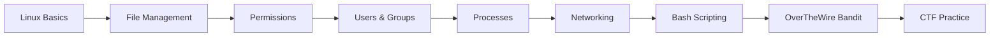

<div align="center">

# 🐧 Linux Commands & Bash Scripting  
### Personal Notes for Junior Penetration Testing


<br>


</div>

---

## 👤 About This File

> **Author:** Youhana Emad  
> **Role:** Junior Penetration Tester  
> **Purpose:** Personal reference notes for Linux fundamentals, Bash scripting, and cybersecurity practice.

This Markdown file is a polished and expanded version of my Linux and Bash notes.  
It is designed to help me build strong command-line skills, understand Linux behavior, and prepare for real-world cybersecurity and penetration testing tasks.

Linux is one of the most important skills for penetration testers because most security tools, servers, labs, CTF platforms, and exploitation environments depend on Linux.

---

## ✨ What Was Added

- 🎬 Animated typing banner for a professional GitHub README style.
- 🛡️ Badges for Linux, Bash, Cybersecurity, and practice platforms.
- 📌 Clean table of contents.
- 📂 Organized command sections.
- 🧠 Notes, tips, and practical examples.
- 🧪 Pentesting-relevant networking commands.
- 🧾 Bash scripting templates.
- ✅ Practice checklist.
- 📚 Resources for continuous learning.
- ⚠️ Ethical use reminder.

---

## 📚 Table of Contents

- [📌 Introduction](#-introduction)
- [🧭 Linux Filesystem Basics](#-linux-filesystem-basics)
- [🖥️ System Information Commands](#️-system-information-commands)
- [📁 File Management Commands](#-file-management-commands)
- [🔎 Searching and Filtering](#-searching-and-filtering)
- [🔐 Permissions](#-permissions)
- [👥 Users and Groups](#-users-and-groups)
- [⚙️ Process Management](#️-process-management)
- [📦 Package Management](#-package-management)
- [🌐 Networking Commands](#-networking-commands-pentesting-relevant)
- [🖊️ Bash Scripting Basics](#️-bash-scripting-basics)
- [🧪 Mini Bash Scripts](#-mini-bash-scripts)
- [🧰 Useful Aliases](#-useful-aliases)
- [✅ Practice Checklist](#-practice-checklist)
- [📚 Resources](#-resources)

---

## 📌 Introduction

My name is **Youhana Emad**, and I am a **Junior Penetration Tester**.

This file contains my personal notes about essential **Linux commands** and **Bash scripting basics**. These notes are designed to help me understand and practice the most important commands used in Linux environments, especially commands related to:

- 🖥️ System information
- 📁 File management
- 🔐 Permissions
- 👥 Users and groups
- ⚙️ Processes
- 📦 Package management
- 🌐 Networking
- 🖊️ Bash scripting
- 🧪 Cybersecurity practice

> [!TIP]
> Do not just memorize commands. Run them in a safe lab environment, understand the output, and document what each command does.

---

## 🧭 Linux Filesystem Basics

Linux uses a hierarchical filesystem structure starting from the root directory `/`.

```text
/
├── bin      Essential user binaries
├── boot     Boot loader files
├── dev      Device files
├── etc      Configuration files
├── home     User home directories
├── lib      Shared libraries
├── media    Mounted removable media
├── mnt      Temporary mount points
├── opt      Optional applications
├── proc     Process and kernel information
├── root     Root user home directory
├── sbin     System binaries
├── tmp      Temporary files
├── usr      User programs and libraries
└── var      Logs, cache, and variable data
```

| Path | Purpose |
|---|---|
| `/home` | Normal users' home directories |
| `/root` | Root user's home directory |
| `/etc` | System configuration files |
| `/var/log` | Log files |
| `/tmp` | Temporary files |
| `/bin` | Essential commands |
| `/usr/bin` | User commands and applications |

---

## 🖥️ System Information Commands

| Command | Description |
|---|---|
| `uname -a` | Display all system information |
| `hostname` | Show the system hostname |
| `uptime` | Show how long the system has been running |
| `whoami` | Print the current logged-in user |
| `id` | Display user ID and group ID |
| `date` | Show system date and time |
| `df -h` | Show disk space usage in human-readable format |
| `du -sh <dir>` | Show size of a directory |
| `free -h` | Display memory usage |
| `top` / `htop` | Monitor running processes in real time |
| `lscpu` | Show CPU architecture information |
| `lsblk` | List block devices |
| `dmesg` | Show kernel messages |
| `cat /etc/os-release` | Show Linux distribution information |

<details>
<summary>💡 Example</summary>

```bash
whoami
id
hostname
cat /etc/os-release
```

Expected result: You understand the current user, system identity, and Linux distribution.

</details>

---

## 📁 File Management Commands

| Command | Description |
|---|---|
| `ls -la` | List all files including hidden ones with details |
| `pwd` | Print current working directory |
| `cd <dir>` | Change directory |
| `cd ..` | Move one directory up |
| `cd ~` | Go to current user's home directory |
| `mkdir <dir>` | Create a new directory |
| `mkdir -p a/b/c` | Create nested directories |
| `rm <file>` | Remove a file |
| `rm -rf <dir>` | Remove a directory and its contents recursively |
| `cp <src> <dst>` | Copy files or directories |
| `cp -r <src> <dst>` | Copy directories recursively |
| `mv <src> <dst>` | Move or rename files |
| `touch <file>` | Create an empty file |
| `cat <file>` | Display file contents |
| `less <file>` | View file contents page by page |
| `head <file>` | Show first lines of a file |
| `tail <file>` | Show last lines of a file |
| `tail -f <file>` | Follow file updates live |

> [!WARNING]
> Be careful with `rm -rf`. It deletes recursively and does not ask for confirmation by default.

---

## 🔎 Searching and Filtering

| Command | Description |
|---|---|
| `find / -name <file> 2>/dev/null` | Search for a file by name and hide permission errors |
| `find . -type f -name "*.txt"` | Find `.txt` files in current directory |
| `locate <file>` | Quickly find a file by name |
| `grep "text" <file>` | Search for text inside a file |
| `grep -r "text" .` | Search recursively inside files |
| `grep -i "text" <file>` | Case-insensitive search |
| `sort <file>` | Sort lines |
| `uniq <file>` | Remove repeated adjacent lines |
| `sort <file> \| uniq -c` | Count unique lines |
| `wc -l <file>` | Count lines |
| `cut -d ":" -f1 /etc/passwd` | Extract fields from text |

<details>
<summary>🎯 Useful CTF Example</summary>

Find a readable file owned by a specific user:

```bash
find / -user bandit7 -type f 2>/dev/null
```

Find lines containing a word:

```bash
grep "password" data.txt
```

Find the only unique line in a file:

```bash
sort data.txt | uniq -u
```

</details>

---

## 🔐 Permissions

### Understanding Permission Notation

```text
-rwxr-xr--
 ↑↑↑ ↑↑↑ ↑↑↑
 │    │   └── Others: read only
 │    └────── Group: read + execute
 └─────────── Owner: read + write + execute
```

| Symbol | Meaning |
|---|---|
| `r` | Read |
| `w` | Write |
| `x` | Execute |
| `-` | No permission |

### Common Permission Commands

| Command | Description |
|---|---|
| `ls -l` | View file permissions |
| `chmod 755 <file>` | Set permissions using numeric notation |
| `chmod u+x <file>` | Add execute permission for owner |
| `chmod g-w <file>` | Remove write permission from group |
| `chown user:group <file>` | Change owner and group |
| `umask` | Show or set default permission mask |

### Numeric Permission Reference

| Value | Permission |
|---|---|
| `7` | `rwx` read, write, execute |
| `6` | `rw-` read, write |
| `5` | `r-x` read, execute |
| `4` | `r--` read only |
| `0` | `---` no permissions |

<details>
<summary>🔐 Example</summary>

```bash
chmod 700 script.sh
chmod +x script.sh
./script.sh
```

This makes the script executable and runs it.

</details>

---

## 👥 Users and Groups

| Command | Description |
|---|---|
| `whoami` | Show current user |
| `id` | Show UID, GID, and groups |
| `groups` | Show groups for current user |
| `cat /etc/passwd` | List system users |
| `cat /etc/group` | List system groups |
| `sudo <command>` | Run command with elevated privileges |
| `su - <user>` | Switch user |
| `passwd` | Change current user's password |

> [!NOTE]
> In penetration testing labs, checking users, groups, and sudo privileges is important for privilege escalation practice.

---

## ⚙️ Process Management

| Command | Description |
|---|---|
| `ps aux` | Show all running processes |
| `ps aux | grep <name>` | Search for a process |
| `top` | Monitor processes live |
| `htop` | Interactive process monitor |
| `kill <PID>` | Terminate a process by PID |
| `kill -9 <PID>` | Force kill a process |
| `pkill <name>` | Kill processes by name |
| `jobs` | List background jobs |
| `bg` | Resume a job in the background |
| `fg` | Bring a job to the foreground |
| `nohup <cmd> &` | Run command immune to hangups |
| `nice -n <value> <cmd>` | Run command with a priority value |

---

## 📦 Package Management

### Debian / Ubuntu — APT

```bash
sudo apt update              # Refresh package lists
sudo apt upgrade             # Upgrade all packages
sudo apt install <package>   # Install a package
sudo apt remove <package>    # Remove a package
sudo apt search <package>    # Search for a package
sudo apt autoremove          # Remove unused packages
```

### Red Hat / CentOS / Fedora — YUM / DNF

```bash
sudo yum install <package>   # Install a package using yum
sudo dnf install <package>   # Install a package using dnf
sudo dnf update              # Update all packages
sudo rpm -qa                 # List installed packages
```

---

## 🌐 Networking Commands — Pentesting Relevant

> [!IMPORTANT]
> Use scanning and testing commands only on systems you own or have explicit permission to test.

| Command | Description |
|---|---|
| `ifconfig` / `ip a` | Show network interfaces |
| `ip route` | Show routing table |
| `ping <host>` | Test connectivity to a host |
| `netstat -tuln` | List open ports and listening services |
| `ss -tuln` | Modern replacement for `netstat` |
| `nmap <target>` | Scan a target for open ports |
| `curl <url>` | Transfer data from a URL |
| `wget <url>` | Download files from the web |
| `traceroute <host>` | Trace route to a host |
| `dig <domain>` | DNS lookup |
| `whois <domain>` | Query domain registration information |
| `tcpdump -i <interface>` | Capture packets from an interface |

<details>
<summary>🧪 Safe Lab Examples</summary>

Scan your local machine:

```bash
nmap 127.0.0.1
```

Show listening ports:

```bash
ss -tuln
```

Check DNS records:

```bash
dig example.com
```

</details>

---

## 🖊️ Bash Scripting Basics

### 1. Hello World Script

```bash
#!/bin/bash

echo "Hello, World!"
```

Run it:

```bash
chmod +x hello.sh
./hello.sh
```

---

### 2. Variables

```bash
#!/bin/bash

name="Youhana"
role="Junior Penetration Tester"

echo "My name is $name"
echo "My role is $role"
```

---

### 3. User Input

```bash
#!/bin/bash

read -p "Enter your name: " name
echo "Welcome, $name!"
```

---

### 4. Conditional Statements

```bash
#!/bin/bash

if [ "$1" -gt 100 ]; then
  echo "Number is greater than 100"
else
  echo "Number is 100 or less"
fi
```

> [!TIP]
> Always use quotes around variables like `"$name"` to avoid errors when the value contains spaces.

---

### 5. Loops

#### For Loop

```bash
#!/bin/bash

for i in {1..5}; do
  echo "Iteration $i"
done
```

#### While Loop

```bash
#!/bin/bash

count=0

while [ "$count" -lt 5 ]; do
  echo "Count: $count"
  ((count++))
done
```

---

### 6. Functions

```bash
#!/bin/bash

greet() {
  echo "Hello, $1!"
}

greet "Youhana"
```

---

### 7. Arguments

```bash
#!/bin/bash

echo "Script name: $0"
echo "First argument: $1"
echo "Second argument: $2"
echo "Total arguments: $#"
```

Run:

```bash
./script.sh linux bash
```

---

## 🧪 Mini Bash Scripts

### Script 1 — System Information

```bash
#!/bin/bash

echo "=============================="
echo "       System Information"
echo "=============================="
echo "User: $(whoami)"
echo "Hostname: $(hostname)"
echo "Kernel: $(uname -r)"
echo "Uptime: $(uptime -p)"
echo "Disk Usage:"
df -h
```

---

### Script 2 — Check If a Host Is Alive

```bash
#!/bin/bash

read -p "Enter host or IP: " host

if ping -c 1 "$host" > /dev/null 2>&1; then
  echo "[+] $host is reachable"
else
  echo "[-] $host is not reachable"
fi
```

---

### Script 3 — Simple Port Check

```bash
#!/bin/bash

read -p "Enter host: " host
read -p "Enter port: " port

timeout 3 bash -c "cat < /dev/null > /dev/tcp/$host/$port" 2>/dev/null

if [ "$?" -eq 0 ]; then
  echo "[+] Port $port is open on $host"
else
  echo "[-] Port $port is closed or filtered on $host"
fi
```

---

### Script 4 — Backup a Directory

```bash
#!/bin/bash

src="$1"
backup_name="backup_$(date +%Y%m%d_%H%M%S).tar.gz"

if [ -z "$src" ]; then
  echo "Usage: $0 <directory>"
  exit 1
fi

tar -czf "$backup_name" "$src"
echo "[+] Backup created: $backup_name"
```

---

## 🧰 Useful Aliases

Add these aliases to `~/.bashrc` or `~/.zshrc`.

```bash
alias ll='ls -la'
alias cls='clear'
alias ports='ss -tuln'
alias myip='ip a'
alias update='sudo apt update && sudo apt upgrade -y'
alias grep='grep --color=auto'
```

Reload shell configuration:

```bash
source ~/.bashrc
```

---

## 🧠 Bash Best Practices

| Practice | Reason |
|---|---|
| Use `#!/bin/bash` | Defines the interpreter |
| Quote variables | Prevents word splitting errors |
| Use comments | Makes scripts readable |
| Validate input | Avoids unexpected behavior |
| Use meaningful names | Improves maintainability |
| Test in a safe environment | Prevents accidental damage |

---

## ✅ Practice Checklist

Use this checklist to track your progress.

- [ ] Navigate the filesystem using `cd`, `ls`, and `pwd`
- [ ] Create, copy, move, and delete files
- [ ] Understand hidden files
- [ ] Search files using `find`
- [ ] Search text using `grep`
- [ ] Understand Linux permissions
- [ ] Use `chmod` and `chown`
- [ ] Check running processes
- [ ] Install packages using `apt`
- [ ] Check network configuration
- [ ] Use `ping`, `ss`, `curl`, and `nmap` in a lab
- [ ] Write a basic Bash script
- [ ] Use variables, conditions, loops, and functions
- [ ] Practice OverTheWire Bandit levels

---

## 🚀 Suggested Learning Path



---


## ⚠️ Ethical Reminder

Penetration testing skills must be used legally and ethically.

✅ Test your own systems.  
✅ Use legal labs like OverTheWire, TryHackMe, and Hack The Box.  
✅ Get written permission before testing any real target.  
❌ Do not scan, exploit, or attack systems without authorization.

---

<div align="center">

### 🐧 Keep Practicing. Keep Learning. Keep Hacking Ethically.


</div>

---

# 📁 File Management

## Copy
```bash
cp file.txt /home/kali/
cp -r dir1/ dir2/
cp -i file.txt /tmp/
cp -v file.txt backup/
```
# -r → recursive
# -i → interactive (safe)
# -v → verbose

Example:
```bash
cp /etc/passwd passwd.bak
```

---

## Move / Rename
```bash
mv file.txt /home/kali/
mv file.txt new.txt
mv *.log logs/
mv -i file.txt /tmp/
```

---

## Remove
```bash
rm file.txt
rm -i file.txt
rm -r folder/
rm -rf folder/
rm *.tmp
```
⚠️ NEVER:
```bash
rm -rf /home/kali/test
```

---

# 🔎 Searching

## find
```bash
find / -name file.txt
find / -type f -name "*.txt"
find / -type d -name test
find / -perm 777
find / -size +1M
find / -empty
```

## execute with find
```bash
find / -name "rockyou.txt" -exec mv {} /tmp/pass.txt \;
find /tmp -name "*.tmp" -delete
```

## locate
```bash
locate passwd
updatedb
```

---

# 🔎 grep (Advanced)
```bash
grep "root" file.txt
grep -i "password" file.txt
grep -r "password" .
grep -n "error" file.log
grep -v "root" file.txt
```

Example:
```bash
cat file.txt | grep "admin"
```

---

# 🔤 Regular Expressions (Regex Basics)

| Pattern | Meaning |
|--------|--------|
| `\w` | letters or numbers |
| `\d` | digits [0-9] |
| `\s` | spaces |
| `\W` | not letters or numbers |
| `\D` | not digits |
| `\S` | not spaces |
| `.` | any character |
| `^` | start of line |
| `$` | end of line |
| `\?` | literal ? |
| `\!` | literal ! |
| `\.` | literal . |
| `\$` | literal $ |
| `\d{2}` | exactly 2 digits |
| `\s{3}` | exactly 3 spaces |

Example:
```bash
touch file.txt
echo "Hello612 we are here" >> file.txt
cat file.txt | grep -E "\w{5}[0-9]{3}"
```

---

# 🔐 Permissions (Advanced)

## chmod
```bash
chmod 777 file.txt
chmod +x script.sh
chmod u+x file.sh
```

## chown
```bash
chown user:group file.txt
```

## Special Permissions

### SUID
```bash
chmod u+s file
```

### SGID
```bash
chmod g+s directory
```

### Sticky Bit
```bash
chmod +t directory
```

---

# 📖 File Viewing
```bash
cat file.txt
less file.txt
more file.txt
head file.txt
tail file.txt
tail -f log.txt
nl file.txt
```

---

# ✏️ Editors
```bash
nano file.txt
vim file.txt
```

---

# 🗜️ Compression
```bash
zip files.zip a.txt b.txt
unzip files.zip

tar -czf archive.tar.gz folder/
tar -xvf archive.tar.gz
```

---

# 📚 Documentation
```bash
man ls
apropos scan
whatis nmap
info bash
sudo mandb
```

---
## 📚 Resources

- [Linux Foundation](https://www.linuxfoundation.org)
- [Bash Beginners Guide](https://tldp.org/LDP/Bash-Beginners-Guide/html/)
- [OverTheWire Bandit](https://overthewire.org/wargames/bandit/)
- [TryHackMe Linux Fundamentals](https://tryhackme.com)
- [Hack The Box Academy](https://academy.hackthebox.com)
- [GNU Bash Manual](https://www.gnu.org/software/bash/manual/bash.html)

---
